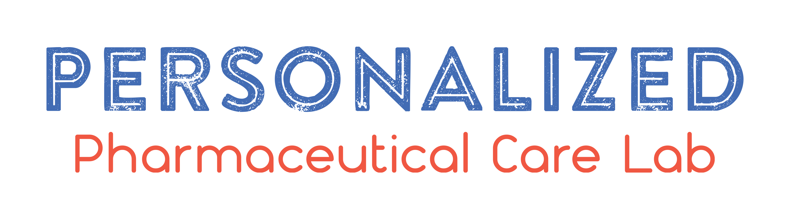

# The Team

## Principal Investigator

  

    
    <h3>Woorim Kim, Ph.D.</h3>
    
Assistant Professor

    
College of Pharmacy, Kangwon National University

    
📧 woorimkim@kangwon.ac.kr

     
    <a href="https://pharmacy.kangwon.ac.kr/pharmacy/professor/professor.do?mode=view&key=$cms$IwBgHAzGCsQ&" class="btn-art">Faculty Profile</a>
  

## Researchers

  

    

        
    

    <h3>Researcher Name</h3>
    
Postdoctoral Fellow

    
Focus: Pharmacogenomics

  

  

    

        
    

    <h3>Researcher Name</h3>
    
Ph.D. Candidate

    
Focus: AI Analytics

  

## Graduate Students

  

    

        
    

    <h3>Student Name</h3>
    
Master's Student

  

  

    

        
    

    <h3>Student Name</h3>
    
Master's Student

  

  

## Lab Life

  

    
  

  

    
  

  

    
  

